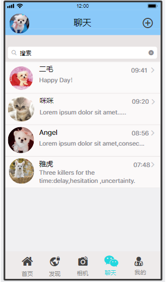

<!DOCTYPE html>
<html>
<head>
</head>
<body>
     
    <h1>2016级项目实训成果展示</h1>
    <h2>《爱宠点滴》 - HTML5与互联网开发</h2>
    <h3>项目简介</h3>
            
爱宠点滴是一款能为人们提供各种关于宠物的交流，帮助用户解决宠物烦恼，提高生活质量的App。
        爱宠点滴是养宠物的人的生活引导者，旨在提供用户关于宠物的交流，让人们热爱宠物，App大体功能
        分为五个模块：首页、发现、相机、我的。宠物经济在工内外市场已经形成了一个比较完善的体系，
        它包含了繁育、训练、用品用具、医疗、贸易等以整套完整的产业。宠物市场越来越旺盛，所以，爱宠点滴
        App的发明时不我待。

     
    <h3>项目成员</h3>
        <ul>
            <li>李敬单</li>
             
            <li>宋莹然</li>
             
            <li>李建辉</li>
             
            <li>康润芳</li>
             
            <li>王洁</li>
             
            <li>侯苏洪</li>
             
        </ul>
    <h3>运行效果</h3>
    
     
    
     
    
     
    
     
    
     
    
<body>
</html>